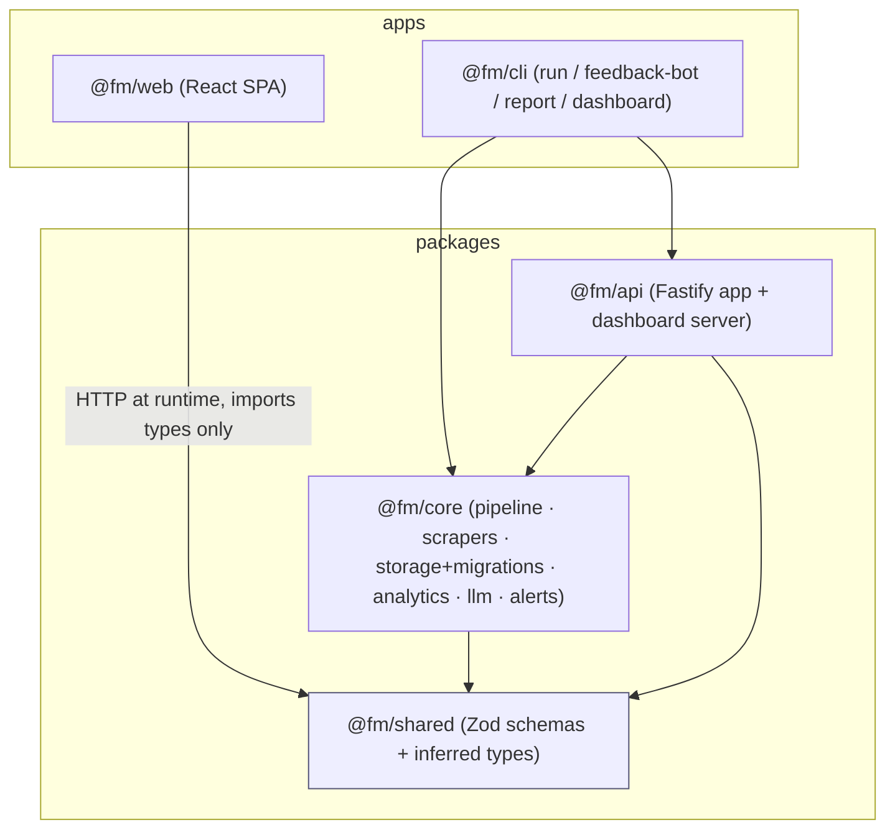

# Monorepo / Workspaces Plan

**Repo:** `fashion-monitor`.
**Scope:** Analysis and planning only — no code, dependencies, configuration, or git state changed. This plan **builds on** `docs/plans/stack-modernization.md`; several decisions here (package manager, build orchestrator, Zod 4 everywhere) are themselves "current-tech" conclusions from that document.
**Goal:** Split today's single-package repo (with a nested, separately-installed `web/` app) into a clean **workspaces monorepo** with explicit package boundaries, a single shared schema/type source of truth, and a keep-green incremental migration path.

---

## 1. Why, and what we're starting from

Today the repo is effectively **two npm projects in one tree**:

- Root `package.json` (the backend: `src/`, ESM, NodeNext, Zod 3) whose `build` script shells into the SPA with `npm --prefix web install && npm --prefix web run build`, then `tsc`, then **copies artifacts**: `web/dist → dist/dashboard/public` and `src/storage/migrations/*.sql → dist/storage/migrations`.
- `web/package.json` (the SPA: React 19 / Vite 8 / Tailwind 4 / Zod 4) with its own lockfile and `node_modules`.

This produces three concrete problems a monorepo fixes:

1. **Duplicated, drifting contracts.** `web/src/lib/types.ts` is a hand-written mirror of backend response shapes (`DashboardPayload`, `Monitor`, `SystemResponse`, `Capability`, `Role`, …). It has **already drifted**: the SPA's `Platform` union includes `vinted`, and the backend `PLATFORMS` (`src/core/types.ts`) also lists `vinted` while several scrapers don't implement it — the manual mirror invites exactly this skew.
2. **Two toolchains, two installs, brittle build glue.** `npm --prefix` is not a real workspace; there's no shared dependency resolution, no graph-aware build/test, and version skew (Zod 3 vs 4, TS 5.7 vs 6, Vitest 3 vs 4, ESLint 9 vs 10) lives across the boundary.
3. **No enforced boundaries.** Everything in `src/` can import everything else, which has already produced **circular dependencies** (documented in §4).

The stack-modernization plan's prerequisite work — **Zod 4 on the backend** and **pnpm as the package manager** — is what makes a shared package _possible_; this plan assumes both are done (or done as the first migration steps).

---

## 2. Package manager + workspace mechanism + orchestrator

### Decision

- **Package manager / workspaces: pnpm 10 workspaces** (`pnpm-workspace.yaml` + `workspace:*` protocol).
- **Build orchestrator: Turborepo.**
- **Version alignment: pnpm Catalogs** (`catalog:`) so React, Zod, TypeScript, Vitest, ESLint versions are declared once and shared.

### Rationale (carried over from the modernization plan)

- **pnpm over npm/Bun/Yarn:** pnpm 10 is the 2026 default for monorepos — strict dependency isolation (surfaces phantom imports during dev, which matters once packages must declare real deps), content-addressable store, first-class `workspace:*` + graph-aware `--filter`, and **version catalogs** to end the Zod-3-vs-4 / TS-5.7-vs-6 skew. npm workspaces lack topological/affected commands; Bun is fastest to install but has monorepo edge cases and we depend on **native addons** (`better-sqlite3`, `argon2`) and Playwright where Node compatibility matters more than install speed.
- **Turborepo over Nx:** this is a **small repo (~4–6 packages)**. 2026 guidance is Turborepo for < ~20 packages / "add caching with minimal config," Nx once you need enforced module boundaries, generators, and distributed execution across 20–30+ packages. Turborepo gives us `dependsOn: ["^build"]` task ordering, remote/local caching, and `turbo prune --docker` for slim images without Nx's heavier conceptual surface.

### Tradeoffs / call-outs

- pnpm's symlinked `node_modules` occasionally needs `node-linker`/hoist tweaks for tools that walk `node_modules` naively; `better-sqlite3` + `argon2` + Playwright are known-good with pnpm but must be in `dependencies` of the package that uses them (no more accidental hoisting from a single root install).
- Turborepo caching requires correct `inputs`/`outputs` declarations or you cache-poison; the `.sql`-copy and SPA-copy steps (§6) must be modeled as task outputs.
- If the project later grows many fine-grained packages or multiple deployable apps, revisit Nx — but **do not start there.**

---

## 3. Proposed package layout

```
fashion-monitor/
├─ pnpm-workspace.yaml          # packages: ["packages/*", "apps/*"]
├─ turbo.json                   # build/test/lint/typecheck pipeline
├─ package.json                 # root: dev tooling only (no app deps), catalogs
├─ tsconfig.base.json           # shared compilerOptions (NodeNext, strict, TS6 defaults)
├─ packages/
│  ├─ shared/                   # @fm/shared  — Zod schemas + inferred types (no runtime deps beyond zod)
│  ├─ core/                     # @fm/core    — pipeline + scrapers + storage + analytics + llm + alerts + config + lib
│  └─ api/                      # @fm/api     — Fastify app (src/web + dashboard server)
├─ apps/
│  ├─ web/                      # @fm/web     — React SPA (today's web/)
│  └─ cli/                      # @fm/cli     — run / feedback-bot / report / dashboard entrypoints
├─ Dockerfile / docker-compose.yml / Caddyfile   # updated for workspace builds (§7)
└─ docs/
```

### Package responsibilities and dependency direction

| Package | Contains (from today's tree) | Depends on |
| --- | --- | --- |
| **`@fm/shared`** | New home for cross-cutting contracts: `Platform`/`PLATFORMS`, `ScoreVerdict`, `Capability`, `Role`, monitor/settings/user **Zod input schemas**, and the API **DTOs** currently duplicated in `web/src/lib/types.ts` (`DashboardPayload`, `Monitor`, `SystemResponse`, `SecretsResponse`, …). Plus `src/llm/schemas.ts` (`ScoringResultSchema`). | `zod` only |
| **`@fm/core`** | `src/pipeline`, `src/platforms`, `src/storage` (incl. `migrations/`), `src/analytics`, `src/llm`, `src/alerts`, `src/config`, `src/core`, `src/lib` | `@fm/shared`, runtime deps (better-sqlite3, playwright, impit, scrapfly, anthropic, ollama, cheerio, yaml, argon2, @noble/*) |
| **`@fm/api`** | `src/web/*` (Fastify app, auth, rbac, routes, secrets-crypto, validation) + `src/dashboard/server.ts` | `@fm/core`, `@fm/shared`, fastify + plugins |
| **`@fm/web`** | today's `web/` SPA verbatim | `@fm/shared` (+ its own React/Vite/Tailwind stack) |
| **`@fm/cli`** | `src/cli/*` (`run`, `feedback-bot`, `report`, `dashboard`) | `@fm/core`, `@fm/api` |

The dependency graph is **acyclic and one-directional**: `shared` ← everyone; `core` ← api, cli; `api` ← cli. `web` depends only on `shared` (it talks to `api` over HTTP, never imports it).

### Why these boundaries (justified against real imports)

- **`shared` is justified by `web/src/lib/types.ts`** being a literal hand-copy of backend shapes (and by `src/web/routes/monitors.ts` defining `MonitorCreateInput` Zod schemas the SPA's react-hook-form would love to reuse). One package, both consumers, zero drift.
- **`api` separate from `core`** is justified by `src/dashboard/server.ts` and every `src/web/routes/*` importing _downward_ into `core` concerns (`storage/repos/*`, `core/profile-config`, `analytics/queries`) — the web layer is a consumer of core, not part of it.
- **`cli` separate** is justified by `src/cli/run.ts` importing **both** `core` (`pipeline/orchestrator`, `storage/db`, `platforms/...`) and, for the dashboard CLI, `api` (`web/app` via `dashboard/server`). The CLIs are the composition roots; they belong above both.
- **`core` kept coarse on purpose.** It would be tempting to split `storage` / `scrapers` / `llm` into their own packages, but they are tightly interwoven today (the pipeline orchestrator pulls platforms + storage + llm + alerts together). Start coarse; split later only if a real reuse boundary appears (see §9 "defer").

---

## 4. Circular dependencies to break before/while extracting

Cross-package cycles are **fatal** in a workspace build graph (Turborepo + project references won't topologically order them), so the two known cycles must be cut. Both happen to live **inside `@fm/core`**, so they don't cross package lines — but they should still be fixed because they signal the kind of coupling that becomes a hard error at a boundary.

1. **`src/web` routes ↔ `src/web/app.ts`** (will straddle `@fm/api` internally).
   `app.ts` imports `registerMonitorRoutes`/`registerSettingsRoutes`/… from `routes/*`, while every `routes/*.ts` imports `WebContext` **and** `requireCapability` back from `app.ts`. **Fix:** extract `WebContext` (the type) and `requireCapability`/`capabilityList` into a small `src/web/context.ts`. Routes import from `context.ts`; `app.ts` imports routes. Cycle broken, and `@fm/api` gets a clean internal layering.

2. **`src/platforms/grailed/algolia.ts` ↔ `src/platforms/grailed/credentials.ts`** (inside `@fm/core`).
   `credentials.ts` imports `queryGrailedAlgolia` from `algolia.ts` (to validate creds), and `algolia.ts` imports `getGrailedCredentials` from `credentials.ts` (to build requests). **Fix:** make `algolia.ts` credential-agnostic — have callers pass `{ appId, apiKey }` in (it already takes an injectable `fetchFn`, so dependency injection is the established pattern here), or move the pure `getGrailedCredentials` reader into a leaf `grailed/env.ts` that `algolia.ts` imports while `credentials.ts` keeps only the `validate*` flow that depends on `algolia`.

Add an import-cycle guard (the repo already runs **fallow**; `eslint-plugin-import` `no-cycle` or `dpdm` in CI also works) so new cycles can't reappear once boundaries are real.

---

## 5. Sharing Zod schemas + types across `api` and `web` without duplication

This is the headline payoff and it **depends on the modernization plan** putting the backend on **Zod 4** (the SPA is already on Zod 4.4 — you cannot share `z.object(...)` across a v3/v4 boundary).

**Mechanism:**

1. `@fm/shared` exports **Zod schemas as the source of truth**, with types derived via `z.infer`:
   - Request/input schemas (e.g. `MonitorCreateInput`, settings/user inputs) — currently defined inline in `src/web/routes/*`.
   - Response **DTOs** as either Zod schemas or plain `interface`s (e.g. `DashboardPayload`) — currently duplicated in `web/src/lib/types.ts`.
   - Domain enums/unions: `PLATFORMS`/`Platform`, `Capability`, `Role`, `ScoreVerdict`, `ScoringResultSchema`.
2. **`@fm/api`** imports these schemas for runtime validation in its routes (`parseBody(MonitorCreateInput, …)`), guaranteeing the wire contract matches the type.
3. **`@fm/web`** imports the **same** schemas for form validation (`@hookform/resolvers/zod`) and the **inferred types** for typed `fetch` responses — deleting `web/src/lib/types.ts`'s hand-mirror.

**Consumption details / gotchas:**

- `@fm/shared` must be **isomorphic** (no Node-only imports) so the browser bundle stays clean — keep it to `zod` + pure TS. Anything Node-specific (e.g. `better-sqlite3` row types) stays in `@fm/core`, and `@fm/shared` exposes only the serialized DTO shape.
- Publish `@fm/shared` as **TS source consumed directly** in dev (via `exports` pointing at compiled `dist` for type-check, and a `dev` condition / project references for editor speed). For the SPA, Vite resolves the workspace package fine; for `@fm/api` under NodeNext, `@fm/shared` must ship proper ESM `exports` + `.d.ts`.
- Resolve the `vinted` drift while centralizing: one `PLATFORMS` list, and scrapers that don't implement a platform are simply absent from the registry — not a divergent type.

---

## 6. Build, static-serving, migrations, tsconfig, test/lint wiring

### SPA build + server static-serving

Today: root build copies `web/dist → dist/dashboard/public`; `@fm/api`'s `app.ts` serves it via `@fastify/static` and reads `index.html` from `PUBLIC_DIR = dist/dashboard/public` (`src/web/app.ts`).

In the monorepo, model this as a **Turborepo task dependency**:

- `@fm/web#build` outputs `apps/web/dist` (Vite).
- `@fm/api#build` `dependsOn: ["^build", "@fm/web#build"]` and copies `apps/web/dist → packages/api/dist/public` (or a configurable `PUBLIC_DIR`). Keep the existing `existsSync(PUBLIC_DIR)` fallback so backend-only test runs still work without the SPA.
- Alternative (cleaner long-term): make `PUBLIC_DIR` an **env/option** on `WebAppOptions` so the api can serve the SPA from any resolved path, removing the copy entirely in dev (Vite dev server already proxies `/api` to `:3030`, per `web/vite.config.ts`). Recommend keeping the copy for the **production image** and using the proxy for dev.

### SQL migrations + assets in a workspace

`src/storage/db.ts` reads `migrations/` relative to `__dirname` at runtime (`dist/storage/migrations/*.sql`). `tsc` does **not** copy `.sql`, hence today's `build:copy-migrations`.

- Keep migrations at `packages/core/src/storage/migrations/*.sql`.
- Add a per-package `@fm/core#build` step that copies `.sql` into `packages/core/dist/storage/migrations` (declare it as a Turbo task `output`). The `__dirname`-relative resolution then keeps working unchanged inside `@fm/core`'s `dist`.
- Anything that runs migrations (the CLIs, the api) gets them transitively via `@fm/core` — no second copy.

### tsconfig project references

- `tsconfig.base.json` holds shared `compilerOptions` (NodeNext, `strict`, TS-6 explicit defaults: `types: ["node"]`, `verbatimModuleSyntax`; keep `.js` import extensions).
- Each package has its own `tsconfig.json` extending the base with `composite: true` + `references` to its workspace deps: `core → [shared]`, `api → [core, shared]`, `cli → [core, api, shared]`.
- `@fm/web` keeps its **separate** TS setup (`tsconfig.app.json`/`tsconfig.node.json`, bundler resolution via Vite) and references `@fm/shared` only. Don't force the SPA onto NodeNext.

### Test / lint / build wiring (`turbo.json`)

- Pipeline tasks: `build` (`dependsOn: ["^build"]`, declares outputs incl. the copy steps), `typecheck`, `lint`, `test`.
- Run via pnpm filters: `pnpm -r build`, `pnpm --filter @fm/api test`, `turbo run build --filter=...[origin/main]` for affected-only CI.
- Per the modernization plan: backend moves to **Vitest 4 + ESLint 10** so all packages share one test/lint major; keep ESLint as source of truth, optionally add Oxlint as a fast pre-pass; keep Prettier.

### Docker / Caddy impact

- Use **`turbo prune --docker`** to produce a focused subset per service, so each image installs only what it needs:
  - `scraper` / `feedback-bot` / `report` CLIs → prune for `@fm/cli` (pulls `@fm/core`, `@fm/shared`); needs Playwright + native addons.
  - `dashboard` → prune for `@fm/cli`'s dashboard entry (pulls `@fm/api` + `@fm/core` + `@fm/shared` + the built SPA).
- Multi-stage Dockerfile: install with `pnpm` (corepack), build with `turbo`, then copy only `dist` + pruned `node_modules` into the runtime stage. Keep the existing `python3/make/g++/libsqlite3-dev` deps for `better-sqlite3`/`argon2` and the Playwright Chromium install.
- **`docker-compose.yml` service commands change paths** from `dist/cli/run.js` to the workspace output (e.g. `apps/cli/dist/run.js` or a bin exposed by `@fm/cli`). **Caddyfile is unchanged** — it still reverse-proxies `dashboard:3030`.

---

## 7. Migration steps (incremental, keep-green)

Do this in order; each step must land with typecheck + tests + lint green before the next. The first two steps are really the tail of the modernization plan.

1. **Prereqs from the modernization plan:** backend on **Zod 4**, repo on **pnpm** (replace `npm --prefix web` with a real workspace), TS 6 / Vitest 4 / ESLint 10 unified. Without Zod 4 you cannot share schemas.
2. **Introduce the workspace shell** without moving code: add `pnpm-workspace.yaml` + `turbo.json`, convert `web/` into `apps/web` as the first workspace member, keep the backend as a temporary root/`packages/server` package. Confirm build/test/lint run through Turbo. _(Lowest risk; proves the harness.)_
3. **Extract `@fm/shared` first** (biggest payoff, lowest blast radius): move the duplicated DTOs + domain enums + input schemas into `@fm/shared`; point `@fm/web` at it and **delete `web/src/lib/types.ts`'s mirror**; point the backend routes at the shared input schemas. Fix the `vinted` drift here.
4. **Break the two cycles** (§4) so the next splits are clean.
5. **Carve out `@fm/api`** from `@fm/core`: move `src/web/*` + `src/dashboard/server.ts` into `packages/api`, leaving the domain in `packages/core`. Wire the SPA-copy as an `@fm/api#build` output.
6. **Carve out `@fm/cli`** into `apps/cli`; update `docker-compose.yml` command paths and the Dockerfile to the `turbo prune` flow.
7. **Tighten**: project references everywhere, affected-only CI, import-cycle guard in CI, optional `PUBLIC_DIR`-as-option cleanup.

At every step the app stays runnable: the CLIs, the Fastify server, and the SPA build all keep working because we move files and rewire imports rather than rewriting behavior.

---

## 8. Risks

- **pnpm strictness surfaces phantom imports.** Files that relied on hoisted transitive deps will fail until each package declares its real `dependencies`. This is desirable but front-loads work — do it during step 1.
- **Native addons under pnpm + Docker.** `better-sqlite3` / `argon2` must rebuild against the target Node ABI in the runtime image; `turbo prune` must keep their build inputs. Verify Playwright's browser cache path survives the pruned image.
- **Cross-package cycles become hard errors.** If §4 isn't done first, the api/cli extraction will fail to order. Guard it in CI.
- **SQL-migration path resolution.** The `__dirname`-relative `migrations/` lookup must keep landing next to compiled `db.js` inside `@fm/core/dist`. Model the `.sql` copy as a Turbo output so caching doesn't drop it.
- **`@fm/shared` accidentally importing Node-only code** would poison the browser bundle. Enforce isomorphism (lint rule / no Node built-ins in `shared`).
- **Turbo cache correctness.** Wrong `inputs`/`outputs` (especially for the copy steps) can serve stale artifacts; start with conservative caching and expand.

---

## 9. What to do first vs. defer

**Do first (highest value, lowest risk):**

- pnpm workspace + Turbo harness (step 2).
- Extract **`@fm/shared`** and delete the SPA's duplicated types (step 3) — this alone removes the drift class of bugs.
- Break the two circular deps (step 4).

**Defer (until a real need appears):**

- Splitting `@fm/core` into finer packages (`storage` / `scrapers` / `llm`) — keep core coarse until there's genuine reuse pressure.
- Adopting **Nx** — only if the package count grows past ~20 or you need enforced boundaries/generators.
- `rolldown-vite`, dropping `tsx` for native execution, and the LLM-provider consolidation (Ollama via the Anthropic-compatible endpoint) — these are modernization-plan "optional" items; do them after the structure is stable so wiring changes once.
- Multi-instance session storage / Redis — not warranted for the single-instance, single-`profile_id="default"` deployment.

---

## 10. Target package graph



The graph is acyclic, `@fm/shared` is the single contract source for both the server (`@fm/api`) and the browser (`@fm/web`), and the CLIs sit at the top as composition roots over `@fm/core` + `@fm/api`.
