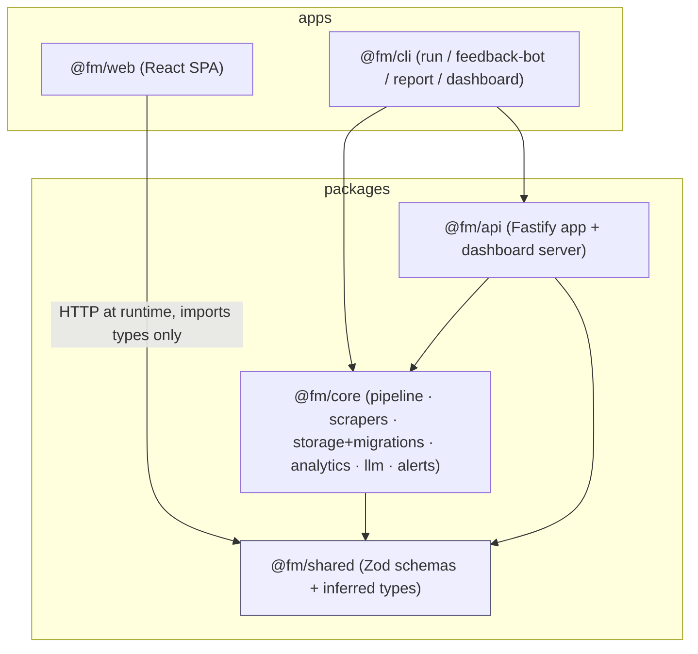

# Monorepo / Workspaces Plan

This document plans splitting fashion-monitor's single-package repo into a proper workspaces monorepo.

**Repo:** `fashion-monitor`.
**Scope:** Analysis and planning only — no code, dependencies, configuration, or git state changed. This plan **builds on** `docs/plans/stack-modernization.md`. Several decisions here — the package manager, the build orchestrator, and using Zod 4 everywhere — are themselves conclusions that document already reached about which current tools to use.
**Goal:** Split today's single-package repo, which has a nested, separately-installed `web/` app bolted onto it, into a clean workspaces monorepo. It should have explicit package boundaries, one shared schema and type source of truth, and an incremental migration path that keeps the app working (green) at every step.

---

## 1. Why, and what we're starting from

Splitting the repo into a workspaces monorepo fixes three concrete problems that today's ad-hoc two-project setup causes.

Today, the repo is effectively **two separate npm projects sharing one Git tree**:

- The root `package.json` is the backend: `src/`, using ES modules (ESM) with NodeNext module resolution, and Zod 3. Its `build` script shells into the SPA with `npm --prefix web install && npm --prefix web run build`, then runs `tsc`, then **copies build artifacts**: `web/dist → dist/dashboard/public` and `src/storage/migrations/*.sql → dist/storage/migrations`.
- `web/package.json` is the SPA — React 19, Vite 8, Tailwind 4, Zod 4 — with its own separate lockfile and `node_modules` folder.

This setup produces three concrete problems a monorepo fixes:

1. **Duplicated, drifting contracts.** `web/src/lib/types.ts` is a hand-written mirror of backend response shapes (`DashboardPayload`, `Monitor`, `SystemResponse`, `Capability`, `Role`, and others). It has **already drifted** from the backend: the SPA's `Platform` union type includes `vinted`, and the backend's own `PLATFORMS` list (`src/core/types.ts`) also lists `vinted`, even though several scrapers don't actually implement that platform. A manually maintained mirror invites exactly this kind of drift.
2. **Two toolchains, two installs, brittle build glue.** `npm --prefix` is not a real workspace mechanism: there's no shared dependency resolution, no graph-aware build or test command, and the version skew across the two halves (Zod 3 vs. 4, TypeScript 5.7 vs. 6, Vitest 3 vs. 4, ESLint 9 vs. 10) lives right across that boundary.
3. **No enforced boundaries.** Anything in `src/` can import anything else in `src/`, which has already produced circular dependencies — documented in §4.

The stack-modernization plan's prerequisite work — putting the backend on **Zod 4**, and adopting **pnpm** — is what makes a shared package between the two halves possible. This plan assumes both of those are already done, or are done as its first migration steps.

---

## 2. Package manager + workspace mechanism + orchestrator

This plan picks pnpm workspaces to manage the packages, and Turborepo to orchestrate builds between them, both carried over as conclusions from the stack-modernization plan.

### Decision

- **Package manager / workspaces:** pnpm 10 workspaces (`pnpm-workspace.yaml` plus the `workspace:*` protocol — a version specifier meaning "use whatever version of this package lives in the workspace," instead of a version pulled from the npm registry).
- **Build orchestrator:** Turborepo (a tool that runs build/test/lint tasks across a monorepo's packages in the right dependency order, and caches their results).
- **Version alignment:** pnpm Catalogs (the `catalog:` version specifier) — this declares one shared version for React, Zod, TypeScript, Vitest, and ESLint in a single place, instead of repeating, and risking drift in, each package's own `package.json`.

### Rationale (carried over from the modernization plan)

- **pnpm over npm, Bun, or Yarn:** pnpm 10 is the 2026 default for monorepos. It enforces strict dependency isolation — this surfaces phantom imports during development (code that uses a package it never actually declared as its own dependency, which happened to be available only because some other package installed it), which matters once each package must declare its real dependencies. It also uses a content-addressable store, has first-class `workspace:*` support plus a graph-aware `--filter` command, and offers version catalogs to end the Zod-3-vs-4 / TypeScript-5.7-vs-6 style of drift. npm workspaces lack topological or affected-only commands. Bun installs fastest, but has known monorepo edge cases, and this repo depends on native addons (`better-sqlite3`, `argon2`) and Playwright, where Node compatibility matters more than install speed.
- **Turborepo over Nx:** this is a small repo, with roughly 4–6 packages. 2026 guidance favors Turborepo for repos under about 20 packages, where the main need is "caching with minimal config," and favors Nx once a project needs enforced module boundaries, code generators, and distributed execution across 20–30+ packages. Turborepo gives this repo `dependsOn: ["^build"]` task ordering (build a package's dependencies before the package itself), remote and local build caching, and `turbo prune --docker` for producing slim Docker images — without Nx's heavier conceptual surface.

### Tradeoffs / call-outs

- pnpm's symlinked `node_modules` folder occasionally needs `node-linker` or hoist setting tweaks, for tools that walk `node_modules` naively instead of respecting symlinks. `better-sqlite3`, `argon2`, and Playwright are all known to work well with pnpm, but each must be listed in the `dependencies` of the specific package that uses it — pnpm won't let a package rely on another package's dependency being hoisted up to a shared root install.
- Turborepo's caching requires correct `inputs` and `outputs` declarations, or it will serve a stale cached result (cache poisoning). The `.sql`-copy and SPA-copy build steps (§6) must be modeled explicitly as task outputs.
- If the project later grows into many fine-grained packages, or multiple deployable apps, revisit Nx then — but **do not start there.**

---

## 3. Proposed package layout

This plan splits the repo into five packages: three under `packages/` (library code) and two under `apps/` (things that actually run).

```
fashion-monitor/
├─ pnpm-workspace.yaml          # packages: ["packages/*", "apps/*"]
├─ turbo.json                   # build/test/lint/typecheck pipeline
├─ package.json                 # root: dev tooling only (no app deps), catalogs
├─ tsconfig.base.json           # shared compilerOptions (NodeNext, strict, TS6 defaults)
├─ packages/
│  ├─ shared/                   # @fm/shared  — Zod schemas + inferred types (no runtime deps beyond zod)
│  ├─ core/                     # @fm/core    — pipeline + scrapers + storage + analytics + llm + alerts + config + lib
│  └─ api/                      # @fm/api     — Fastify app (src/web + dashboard server)
├─ apps/
│  ├─ web/                      # @fm/web     — React SPA (today's web/)
│  └─ cli/                      # @fm/cli     — run / feedback-bot / report / dashboard entrypoints
├─ Dockerfile / docker-compose.yml / Caddyfile   # updated for workspace builds (§7)
└─ docs/
```

### Package responsibilities and dependency direction

| Package | Contains (from today's tree) | Depends on |
| --- | --- | --- |
| **`@fm/shared`** | New home for cross-cutting contracts: `Platform`/`PLATFORMS`, `ScoreVerdict`, `Capability`, `Role`, monitor/settings/user **Zod input schemas**, and the API **DTOs** currently duplicated in `web/src/lib/types.ts` (`DashboardPayload`, `Monitor`, `SystemResponse`, `SecretsResponse`, …). Plus `src/llm/schemas.ts` (`ScoringResultSchema`). | `zod` only |
| **`@fm/core`** | `src/pipeline`, `src/platforms`, `src/storage` (incl. `migrations/`), `src/analytics`, `src/llm`, `src/alerts`, `src/config`, `src/core`, `src/lib` | `@fm/shared`, runtime deps (better-sqlite3, playwright, impit, scrapfly, anthropic, ollama, cheerio, yaml, argon2, @noble/*) |
| **`@fm/api`** | `src/web/*` (Fastify app, auth, rbac, routes, secrets-crypto, validation) + `src/dashboard/server.ts` | `@fm/core`, `@fm/shared`, fastify + plugins |
| **`@fm/web`** | today's `web/` SPA verbatim | `@fm/shared` (+ its own React/Vite/Tailwind stack) |
| **`@fm/cli`** | `src/cli/*` (`run`, `feedback-bot`, `report`, `dashboard`) | `@fm/core`, `@fm/api` |

The dependency graph is **acyclic and one-directional**: `shared` is depended on by everyone; `core` is depended on by `api` and `cli`; `api` is depended on by `cli`. `web` depends only on `shared` — it talks to `api` over HTTP, and never imports it directly.

### Why these boundaries (justified against real imports)

- **`shared` is justified by `web/src/lib/types.ts`**, which is a literal hand-copy of backend shapes, and by `src/web/routes/monitors.ts`, which defines `MonitorCreateInput` Zod schemas that the SPA's react-hook-form code would benefit from reusing directly. One package serves both consumers, and drift becomes structurally impossible.
- **`api` is separate from `core`** because `src/dashboard/server.ts` and every file in `src/web/routes/*` import _downward_ into `core` concerns — `storage/repos/*`, `core/profile-config`, `analytics/queries`. The web layer is a consumer of `core`, not part of it.
- **`cli` is separate** because `src/cli/run.ts` imports both `core` (`pipeline/orchestrator`, `storage/db`, `platforms/...`) and, for the dashboard CLI specifically, `api` (`web/app`, via `dashboard/server`). The CLIs are composition roots — the place where everything gets wired together — so they sit above both `core` and `api` in the dependency order.
- **`core` is kept coarse (broad, not finely split) on purpose.** It would be tempting to split `storage`, `scrapers`, and `llm` into their own packages, but they're tightly interwoven today — the pipeline orchestrator pulls platforms, storage, llm, and alerts together into one flow. Start coarse, and split later only if a real reuse need appears (see §9, "defer").

---

## 4. Circular dependencies to break before/while extracting

Two files currently import each other in a loop, and both must be fixed before the packages that will contain them are split apart.

A cross-package cycle — package A depending on package B which depends back on package A — is fatal in a workspace build graph: Turborepo and TypeScript project references can't put such packages in a build order, since neither can go first. Both of the two cycles that exist today happen to live inside what will become `@fm/core`, so neither crosses a package boundary yet. They still need fixing, though, because each signals the kind of tight coupling that becomes a hard build error the moment a package boundary is drawn through it.

1. **`src/web` routes and `src/web/app.ts`** (this will straddle the future `@fm/api` package internally).
   `app.ts` imports `registerMonitorRoutes`, `registerSettingsRoutes`, and others from `routes/*`. At the same time, every file in `routes/*.ts` imports `WebContext` and `requireCapability` back from `app.ts`. **Fix:** extract the `WebContext` type and the `requireCapability`/`capabilityList` functions into a small new file, `src/web/context.ts`. Routes then import from `context.ts`, and `app.ts` imports the routes. This breaks the cycle, and gives `@fm/api` a clean internal layering.

2. **`src/platforms/grailed/algolia.ts` and `src/platforms/grailed/credentials.ts`** (both inside the future `@fm/core` package).
   `credentials.ts` imports `queryGrailedAlgolia` from `algolia.ts`, to validate credentials. `algolia.ts` imports `getGrailedCredentials` from `credentials.ts`, to build its requests. **Fix:** make `algolia.ts` credential-agnostic — have its callers pass in `{ appId, apiKey }` directly. It already accepts an injectable `fetchFn`, so this dependency-injection pattern is already established here. Alternatively, move the pure `getGrailedCredentials` reader function into a new leaf file, `grailed/env.ts`, which `algolia.ts` can import, while `credentials.ts` keeps only the `validate*` flow that depends on `algolia`.

Add an import-cycle guard to catch any new cycle before it can reappear once these boundaries are real. The repo already runs **fallow** (a code-quality checker); `eslint-plugin-import`'s `no-cycle` rule, or the `dpdm` tool, would also work in CI.

---

## 5. Sharing Zod schemas + types across `api` and `web` without duplication

This is the plan's headline payoff: one shared package holds the Zod schemas both the backend and the frontend use, so the two can never drift apart again. It depends on the modernization plan putting the backend on **Zod 4** first — the SPA is already on Zod 4.4, and a `z.object(...)` schema cannot be shared across a v3/v4 version boundary.

**Mechanism:**

1. `@fm/shared` exports **Zod schemas as the source of truth**, with TypeScript types derived from them automatically via `z.infer` (a Zod feature that generates a matching TypeScript type directly from a schema, so the two can't drift):
   - Request/input schemas, for example `MonitorCreateInput` and the settings/user inputs — currently defined inline in `src/web/routes/*`.
   - Response DTOs, as either Zod schemas or plain `interface`s, for example `DashboardPayload` — currently duplicated in `web/src/lib/types.ts`.
   - Domain enums and unions: `PLATFORMS`/`Platform`, `Capability`, `Role`, `ScoreVerdict`, `ScoringResultSchema`.
2. **`@fm/api`** imports these schemas for runtime validation inside its routes (`parseBody(MonitorCreateInput, …)`), guaranteeing the data actually sent over the wire matches the type the code expects.
3. **`@fm/web`** imports the **same** schemas for its form validation (`@hookform/resolvers/zod`), and the **inferred types** for typed `fetch` responses — this is what lets `web/src/lib/types.ts`'s hand-mirror be deleted entirely.

**Consumption details / gotchas:**

- `@fm/shared` must be **isomorphic** — meaning its code can run unchanged in both the browser and in Node — so the browser bundle stays clean. Keep it to `zod` plus plain TypeScript, with no Node-only imports. Anything Node-specific, like `better-sqlite3` row types, stays in `@fm/core`; `@fm/shared` exposes only the serialized DTO shape.
- Publish `@fm/shared` so it's consumed directly as TypeScript source during development. Its `exports` field (the part of `package.json` that tells other packages which files they're allowed to import) should point at compiled `dist` output for type-checking, with a `dev` condition or TypeScript project references for faster editor feedback. Vite resolves the workspace package fine for the SPA. For `@fm/api`, which uses NodeNext resolution, `@fm/shared` must ship proper ESM `exports` plus `.d.ts` files.
- Resolve the `vinted` drift mentioned earlier while centralizing this: keep one single `PLATFORMS` list, and simply leave any platform a scraper doesn't implement out of that registry, rather than letting two divergent type definitions exist.

---

## 6. Build, static-serving, migrations, tsconfig, test/lint wiring

This section works out how the pieces that cross package boundaries today — the SPA build, SQL migration files, TypeScript config, and Docker images — keep working once the repo is split into packages.

### SPA build + server static-serving

Today, the root build copies `web/dist → dist/dashboard/public`. `@fm/api`'s `app.ts` serves that folder through `@fastify/static`, reading `index.html` from `PUBLIC_DIR = dist/dashboard/public` (`src/web/app.ts`).

In the monorepo, model this as a Turborepo task dependency:

- `@fm/web#build` outputs `apps/web/dist` (built by Vite).
- `@fm/api#build` declares `dependsOn: ["^build", "@fm/web#build"]`, and copies `apps/web/dist → packages/api/dist/public` (or a configurable `PUBLIC_DIR`). Keep the existing `existsSync(PUBLIC_DIR)` fallback, so backend-only test runs still work without the SPA present.
- A cleaner long-term alternative: make `PUBLIC_DIR` an environment variable or option on `WebAppOptions`, so the API can serve the SPA from any resolved path. This removes the copy step entirely during development, since Vite's dev server already proxies `/api` to `:3030` (per `web/vite.config.ts`). This plan recommends keeping the copy for the production image, and using the proxy only in development.

### SQL migrations + assets in a workspace

`src/storage/db.ts` reads its `migrations/` folder relative to `__dirname` at runtime, from `dist/storage/migrations/*.sql`. `tsc` does not copy `.sql` files on its own, which is why today's build has a separate `build:copy-migrations` step.

- Keep the migrations at `packages/core/src/storage/migrations/*.sql`.
- Add a build step to `@fm/core#build` that copies the `.sql` files into `packages/core/dist/storage/migrations`, and declare that copy as a Turbo task output. The `__dirname`-relative resolution then keeps working unchanged, inside `@fm/core`'s own `dist` folder.
- Anything that runs migrations — the CLIs, the API — gets them transitively through `@fm/core`. No second copy step is needed anywhere else.

### tsconfig project references

- `tsconfig.base.json` holds the shared `compilerOptions`: NodeNext, `strict`, and the TypeScript 6 defaults made explicit (`types: ["node"]`, `verbatimModuleSyntax`), keeping the `.js` import extensions.
- Each package gets its own `tsconfig.json`, extending the base config, with `composite: true` and `references` pointing at its workspace dependencies: `core → [shared]`, `api → [core, shared]`, `cli → [core, api, shared]`. (`composite` and `references` are TypeScript's mechanism for building a monorepo's packages in dependency order and reusing already-checked output.)
- `@fm/web` keeps its own separate TypeScript setup (`tsconfig.app.json`/`tsconfig.node.json`, using Vite's bundler-style resolution), and references `@fm/shared` only. Don't force the SPA onto NodeNext resolution.

### Test / lint / build wiring (`turbo.json`)

- Pipeline tasks: `build` (with `dependsOn: ["^build"]`, and outputs declared including the copy steps above), `typecheck`, `lint`, `test`.
- Run these through pnpm's filter flags: `pnpm -r build` runs a command across every package; `pnpm --filter @fm/api test` runs it in just one package; `turbo run build --filter=...[origin/main]` runs it only for packages affected since diverging from `origin/main`, useful for keeping CI fast.
- Per the modernization plan, the backend moves to Vitest 4 and ESLint 10, so every package shares one test and lint major version. Keep ESLint as the source of truth for linting, optionally adding Oxlint as a fast pre-pass; keep Prettier for formatting.

### Docker / Caddy impact

- Use `turbo prune --docker` to produce a focused dependency subset per service, so each Docker image installs only what that service actually needs:
  - The `scraper`, `feedback-bot`, and `report` CLIs prune down to `@fm/cli` (which pulls in `@fm/core` and `@fm/shared`), and need Playwright plus the native addons.
  - The `dashboard` service prunes down to `@fm/cli`'s dashboard entry point (which pulls in `@fm/api`, `@fm/core`, `@fm/shared`, and the built SPA).
- Use a multi-stage Dockerfile: install dependencies with `pnpm` (via corepack, Node's built-in package-manager version manager), build with `turbo`, then copy only the `dist` output and the pruned `node_modules` into the final runtime stage. Keep the existing `python3`/`make`/`g++`/`libsqlite3-dev` build dependencies needed for `better-sqlite3` and `argon2`, and the Playwright Chromium install.
- `docker-compose.yml`'s service commands change their paths, from `dist/cli/run.js` to the new workspace output location — for example `apps/cli/dist/run.js`, or a binary exposed by `@fm/cli`. The **Caddyfile stays unchanged** — it still reverse-proxies `dashboard:3030`.

---

## 7. Migration steps (incremental, keep-green)

Follow these steps in order. Each one must land with a green typecheck, test run, and lint pass before the next begins. The first two steps are really the tail end of the modernization plan.

1. **Prerequisites from the modernization plan:** the backend on Zod 4, the repo on pnpm (replacing `npm --prefix web` with a real workspace), and TypeScript 6, Vitest 4, and ESLint 10 unified across both halves. Without Zod 4, schemas cannot be shared between packages.
2. **Introduce the workspace shell without moving any code.** Add `pnpm-workspace.yaml` and `turbo.json`, convert `web/` into `apps/web` as the first workspace member, and keep the backend as a temporary root or `packages/server` package. Confirm build, test, and lint all run through Turbo. _(Lowest risk; this proves the harness works.)_
3. **Extract `@fm/shared` first.** This has the biggest payoff and the lowest blast radius: move the duplicated DTOs, domain enums, and input schemas into `@fm/shared`, point `@fm/web` at it, and delete `web/src/lib/types.ts`'s mirror. Point the backend routes at the same shared input schemas. Fix the `vinted` drift here.
4. **Break the two circular-dependency cycles** described in §4, so the next splits can happen cleanly.
5. **Carve `@fm/api` out of `@fm/core`.** Move `src/web/*` and `src/dashboard/server.ts` into `packages/api`, leaving the domain logic in `packages/core`. Wire the SPA copy step as an `@fm/api#build` output.
6. **Carve `@fm/cli` out into `apps/cli`.** Update `docker-compose.yml`'s command paths and the Dockerfile to use the `turbo prune` flow.
7. **Tighten everything:** add project references everywhere, set up affected-only CI, add the import-cycle guard to CI, and optionally clean up `PUBLIC_DIR` into a proper option.

At every step, the app stays runnable. The CLIs, the Fastify server, and the SPA build all keep working throughout, because each step moves files and rewires imports rather than rewriting behavior.

---

## 8. Risks

- **pnpm's strictness surfaces phantom imports.** Files that relied on a hoisted transitive dependency (one pulled in indirectly, never declared directly) will fail to build until each package declares its real `dependencies`. This is the desired outcome, but it front-loads work — do it during step 1, not later.
- **Native addons under pnpm plus Docker.** `better-sqlite3` and `argon2` must rebuild against the target Node ABI (Application Binary Interface — the low-level contract compiled native code depends on) inside the runtime image, and `turbo prune` must preserve their build inputs. Verify that Playwright's browser cache path survives the pruned image.
- **Cross-package cycles become hard errors.** If §4's fixes aren't done first, the `api`/`cli` extraction will fail because the build tools can't order the packages. Guard against this in CI.
- **SQL-migration path resolution.** The `__dirname`-relative `migrations/` lookup must keep landing next to the compiled `db.js`, inside `@fm/core/dist`. Model the `.sql` copy step as a Turbo output, so build caching doesn't silently drop it.
- **`@fm/shared` accidentally importing Node-only code** would poison the browser bundle — meaning code that only works in Node would end up shipped to, and break in, the browser. Enforce isomorphism with a lint rule that blocks Node built-ins inside `shared`.
- **Turbo cache correctness.** Wrong `inputs` or `outputs` declarations, especially for the copy steps, can serve a stale cached result instead of a fresh build. Start with conservative caching, and expand it carefully.

---

## 9. What to do first vs. defer

**Do first (highest value, lowest risk):**

- Set up the pnpm workspace and Turbo harness (step 2).
- Extract `@fm/shared`, and delete the SPA's duplicated types (step 3). This alone removes an entire class of drift bugs.
- Break the two circular dependencies (step 4).

**Defer, until a real need appears:**

- Splitting `@fm/core` into finer-grained packages (`storage` / `scrapers` / `llm`). Keep `core` coarse until there's genuine reuse pressure to split it.
- Adopting Nx. Do this only if the package count grows past roughly 20, or if enforced module boundaries and code generators become necessary.
- `rolldown-vite`, dropping `tsx` in favor of native execution, and consolidating the LLM providers (using Ollama's Anthropic-compatible endpoint). These are the modernization plan's "optional" items — do them after this repo's structure is stable, so the build wiring changes only once.
- Multi-instance session storage, or Redis. Neither is warranted for what is currently a single-instance deployment with a single `profile_id="default"`.

---

## 10. Target package graph

This is what the finished dependency graph looks like, once all five packages exist:


```mermaid
graph TD
    subgraph apps
        web["@fm/web (React SPA)"]
        cli["@fm/cli (run / feedback-bot / report / dashboard)"]
    end
    subgraph packages
        api["@fm/api (Fastify app + dashboard server)"]
        core["@fm/core (pipeline · scrapers · storage+migrations · analytics · llm · alerts)"]
        shared["@fm/shared (Zod schemas + inferred types)"]
    end

    web -->|HTTP at runtime, imports types only| shared
    cli --> core
    cli --> api
    api --> core
    api --> shared
    core --> shared

    classDef sh fill:#eef,stroke:#557;
    class shared sh;
```

The graph has no cycles. `@fm/shared` is the single contract source for both the server (`@fm/api`) and the browser (`@fm/web`). The CLIs sit at the top, as the composition roots that wire together `@fm/core` and `@fm/api`.
